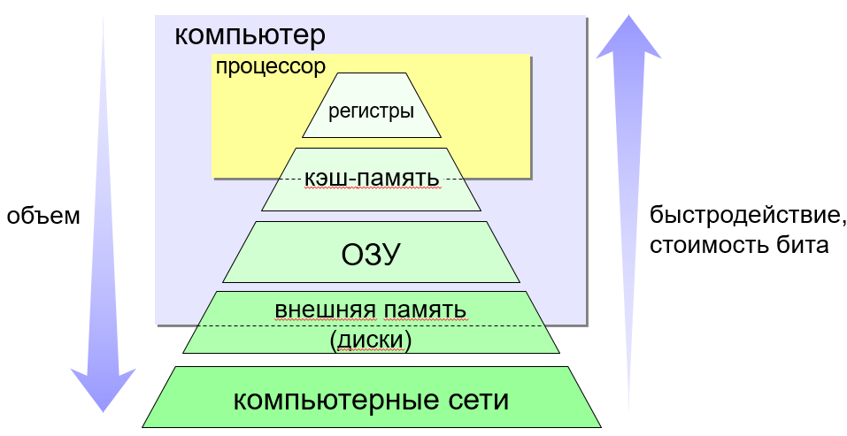

# Требования к курсу:
- Понимать устройство компьютера (отличать системный блок от процессора, знать что внутри есть оперативная память, процессор, диск,)
- Хорошо бы хоть какую-то программу написать до этого, но, наверное, не обязательно.

# План
- Что происходит при запуске компьютера от нажатия кнопки до загрузки ОС. Очень мало про железную часть, более подробно про программную. BIOS, загрузчики, загрузка ОС
- ОС - это тоже просто программа.
- Зачем нам эта ваша ОС?

# Начало

- Что происходит при запуске компьютера? От нажатия кнопки до собственно запуска операционной системы. 
После нажатия кнопки включения системный контроллер (это такое специальное устройство управления) получает от неё сигнал и говорит блоку питания: "Мне нужно больше тока". И тогда дополнительное питание подается на все основные компоненты компьютера: материнскую плату, процессор, оперативную память, жёсткий диск и т.д.
Когда всё это заработало, системный контроллер загружает содержимое самой первой программы в оперативную память и говорит «Ну всё, дальше ты». 
Эта программа называется BIOS - basic input-output system (базовая система ввода-вывода). Вообще-то их много разных, но суть у всех таких программ одна - подготовить основные устройства компьютера к использованию (сбросить, проверить, привести к рабочему состоянию), найти следующую программу и передать её управление.
Вообще единого подхода, который бы работал для абсолютно всех копьютеров нет. В процессе загрузки может быть несколько ступеней. Например типинчый процесс загрузки современных домашних компьютеров будет состоять из:
- загрузки той самой первой программы BIOS
- загрузки первичного загрузчика
- загрузки вторичного загрузчика
- загрузки ОС
Такой многоступенчатый процесс обсуловлен в основном тем, что размеры программ на каждой стадии ограничены особенностями железа. Так, например bios читает только первые 512 байт диска и загружает от туда первичный загрузчик. Первичный загручик очень мал, но может загрузить вторичный, который уже может быть сильно больше и соотвественно может выполнить сильно больше сложных действий. Иногда ограничения железа требуют и большего количества стадий.
Так или иначе мы добираемся до момента, когда базовая инициализация (сброс и приведение к рабочему состоянию) устройств выполнена, а в память загружен код ОС и он может дальше выполняться. Таким образом - ОС - это тоже программа, просто запускается она очень рано, раньше какого-нибудь браузера и офисных программ и т.п. И также она общается с железом напрямую, почти без посредников*.

# Зачем?
- (Вопрос на подумать) Зачем нужна ОС? Насколько обязательна?

Для ответа на этот вопрос заглянем немного назад в истории, во времена, когда первых ЭВМ. Тогда выполнение программ шло по следующему алгоритму: программист отдавал написанное в вычислительный центр, где его работу ставили в очередь, а потом целый ряд программ запускали друг за другом в рамках одного процесса. Это позволяло сэкономить драгоценное время и эффективней использовать ресурсы, но это же и приводило к тому, что фатальная ошибка в одной программе приводило к краху всей очереди.
Увы, от ошибок никто не застрахован. Но можно составлять программу из уже отлаженных "кусков", что позволит быть уверенным в правильности хотя-бы этих кусков. 

И вот с течением времени, эта идея развилась в нечто большее. Появлялось все больше компьютеров и устройств к ним. Почти невозможно было написать программу с нуля, которая бы работала со всеми возможными устройствами. И конечно не хотелось переписывать свою программу по нескольку раз. И тогда задумались, что стоит разделить программу на 2 части. Одна (драйвер) - общается с оборудованием и сильно отличается от устройства к устройству, а другая - выполняет основную работу, используя драйвер, когда нужно обратится к какому-нибудь устройству. 

Так вот, одна из задач ОС - быть эдаким сборником драйверов и предоставлять возможности удобно и единообразно общаться с разными устройствами.
- Чтобы говорить дальше на одном языке, стоит ввести такое слово как "интерфейс". Кто знает что это такое (ну вдруг)?
В общем представлении - это способ общения чего-то с чем-то. Например мы в основном говорим о взаимодействии программ, хотя язык людей - это тоже своего рода интерфейс = набор всем понятных выражений.
ОС предостваляет интерфейс для программ. А уже она перенаправляет команды внутренним и внешним устройствам, другим программам. Таким образом ОС выступает в роли посредника как в общении программ друг с другом, так и программ с железом и внешними устройствами. 

*Картинка из книги таненбаума*

Теперь перейдем ко второй функции ОС. Система позволяет делить между несколькими программами ограниченные ресурсы компьютера (такие как время для выполнения и память). **А задача - распределить их хорошо и грамотно!**
- Что это означает на самом деле: мы можем запустить кучу всего: просмотр видео, прослушивание музыки, игры, интеренет браузер, текстовый редактор и т.д. И всё это **для нас** должно работать одновременно. И хорошо бы, чтобы на все эти задачи хватило времени и памяти. Контролем над этими процессами и занимается ОС. Пример со звуком:
- Мы можем одновременно, например, слушать музыку и листать текст на экране. И кажется, что и музыкальный плеер и программа в которой мы смотрим на текст выполняются одновременно. Однако на самомо деле, программы просто очень быстро переключаются между собой: так быстро, что мы даже этого не замечаем. При чем же тут ОС? Она занимается тем, что контроллирует сколько времени какой программе достанется.
Тоже самое с памятью, местом на диске, доступом к определенным его кускам и пр., ОС разграничивает программы между собой, позволяя им работать вместе так, что большую часть времени каждая программа и не подозревает, что она на компьютере не одна. Самый очевидный пример в том, что

**И так, что же делает ОС? Какие функции она имеет?**
Ожидаемый ответ:
- предоставляет общий интерфейс для работы с разным железом.
- управление (разделение между программами) ресурсами этого самого железа (процессорного времени, памяти и т.п.)

Таким образом - конечным пользователям, в общем то, операционная система на прямую не нужна. Им нужна возможность использовать другие привычные программы (бразузер, игрушки, редакторы чего-либо и т.п.). Такие программы называются прикладными. И вот эта прослойка в виде ОС нужна самим прикладным программам (а точнее программистам, которые их пишут) для более удобного взаимодействия с компьютерным железом.
К тому же, наличие ОС вообще не обязательно. Например на микроконтроллерах (по типу arduino) никакой ОС обычно нет.
**Почему так? (вспоминаем про то, зачем нужна ОС)**
А зачем она там? Ведь такие устройства обычно решают какую-то одну задачу, а соотвественно и больше одной программы там ни к чему. Значит распределять ресурсы между несколькими не нужно.
Железо тоже заранее определено и врятли кто-то будет подключать что-то новое без переписывания программы.
И еще одна причина (может быть не очевидно) состоит в том, что если сделать все-таки общий интерфейс для железа, то может пострадать скорость выполнения программы. Ведь это почти всегда добавляет как минимум дополнительные куски кода для других устрйоств, которые занимают место в памяти, а ещё программа могут выполняются медленее, просто потому, что её придется пройти больше "вспомогательных слоёв".

# Компоненты компьютера (железо).
Чтобы дальше погрузится в устройство ОС, нужно для начала чуть более подробно погрузится в устройство компьютера.

## Процессор
- "Мозг" компьютера, команды(инструкции), про режимы работы.
Современные процессоры (за редким исключением) обладают как минимум двумя режимами выполнения программ: 
- ядерный режим (он же режим supervisor-а). В нем программе доступны все возможные инструкции процессора, вся память, все остальное оборудование компьютера. Изначальное именно в нём и работает процессор после запуска компьютера.
- пользовательский режим. В нем существуют ограничения на доступ к определенным кускам памяти и командам для процессора для обсепечения безопасности и разграничения доступа к ресурсам компьютера. 
Между этими режимами процессор может переключаться!
Пользовательские программы ВСЕГДА выполняются в пользовательском режиме. И в целом большинство программ стараются выносить туда. Потому как в этом случае программы не могут напрямую взаимодействовать с железом и друг другом. И соотвественно они не смогут навредить друг другу и/или оборудованию. 
О какой безопасности идет речь? Например, о безопасном выполнении последовательности команд, каждая из которых по отдельности довольно опасная. ПРИМЕР с выделением памяти (проверки)! 
Ядро ОС и ядро процессора - это разные вещи! Это просто одинаковый термин, обозначающий что-то главное и основное.

## Память (в общем)
В идеале память компьютера должна быть супер быстрой, её должно быть много, она должна хранить информацию даже при отключении электричества и желательно ещё и дешевой. Но как это часто бывает, все сразу сделать не получается. Потому в компьютерах сейчас используется несколько видов памяти, которые различаются по объему и скорости и энерго-независимоти. 

Регистры, кэши, оперативная память, (SSD, HDD, флешки). Про TLB пока умолчим.

# Шины и I/O

# Устройство ОС, её части
ОС, как и любую сложную вещь, можно разбить на несколько более маленьких составных частей. 
Так вот ОС можно разделить на 2 части по тому, в каком режиме процессора выполняются программы этих частей: ядро и все остальное.
Ядро, что характерно, работает в ядерном режиме. А остальные сервисы/программы в пользовательском режиме.
Готовая ОС, помимо ядра, содержит некоторый набор программ пользовательского режима. Они могут быть заменяемы, также как и ядро. То есть можно использовать одно и тоже ядро с разными программами пользовательского режима. В этом случае ОС - разные, хотя ядро - одинаковое.
Бывает и наоборот. Когда разные ядра могут работать с одним набором пользовательских программ. Однако для этого, необходимо, чтобы **интерфейс** ядра, который используют эти программы был одинаковым для этих двух ядер. Одним из примеров такого подхода являются т.н. posix-совместимые ОС.
Они так называются потому что (внезапно) соответствуют стандарту POSIX (строго говоря это семейство стандартов, он все-таки тоже разивается). Этот стандарт регламентирует много всего в ОС, но всё это можно назвать **интерфейсом для прикладных программ**. Примеров posix-совместимых ОС много. Из более-менее известных: Mac OS X, большинство дистрибутивов linux, iOS, free-bsd*. 

<!-- Проиллюстрирую это следующим примером из реального мира: -->
<!-- Наверное стоит более подробно и с самого начала рассказать про unix/linux/posix/пр. -->
<!-- Может кто-то слышал о таком ядре как linux. Так вот это именно ядро. Само по себе оно хоть и большое, но довольно беспомощьное без других программ. 
- Для начала нужно как-то его загрузить. Для этого есть отдельные программы - загрузчики.
- После загрузки запускается самый первый процесс, называемый init. А уже он запускает все остальные программы.
Какие *остальные*? Например это такие программы, как менеджер входа в систему, подключение к wifi, некоторые части драйверов. --> -->

## Ядро
Ядру ОС доступны все ресурсы компьютера и имеено оно является основным компонентом, который распределяет эти ресурсы. В ядре обычно содержатся такие части как:
- Менеджер памяти. Это модуль, который управляет выделением и освобождением памяти и определяет, какая часть памяти может быть доступна каждому процессу.
- Планировщик задач. Этот компонент обеспечивает распределение процессорного времени между запущенными процессами, управляет приоритетами и временными интервалами выполнения процессов. ССЫЛКА на одновременное выполнение и деление на кусочки
- Обработчики системных вызовов. Эти вызовы предоставляют пользователю возможность взаимодействовать с системой и выполнить операции, которые требуют ресурсов, недоступных программам, которые выполняются в пользовательскомом режиме. Системные вызовы и формируют внешний интерфейс ОС. 
- модуль, обеспечивающий взаимодействие между процессами.
- модуль безопасности / разграничения прав. Контроллирует какой программе можно иметь доступ к определенным ресурсам (например выходу в интернет), а каким - нет. 
<!-- - Ядерные драйверы устройств. Каждое устройство в компьютере должно иметь драйвер, который обеспечивает связь между устройством и ОС. Ядро ОС содержит драйверы устройств, которые обеспечивают работу компьютера с различными устройствами. Хотя запихивание всех драйверов в ядро не единственный возможный вариант.   -->

Потенциально этот список можно как расширить (внеся всё, что можно внутрь ядра), так и уменьшить, выделив части перечисленных подсистем в процессы пространства пользователя. 

### Внешний интерфейс
Внешним интерфейсом, который предоставляет ядро ОС, могут пользоваться как прикладные программы, работающие с этой ОС, так и внешние относительно ядра драйвера. В качестве примера интерфейса для прикладных программ, можно назвать системный вызов для завершения программы. Обычно вызвать его можно выполнив соответствующую процедуру (ExitProcess в windows, exit в macos/linux). 
**TODO:** ЛИБО ЧУТЬ ПОГРУЗИТЬСЯ В ПРОГРАММИРОВАНИЕ, ЛИБО ОБОЙТИ ТЕМУ.
<!-- 
### Драйверы
- Драйверы устройств — это специальные программы, которые позволяют операционной системе взаимодействовать с устройствами компьютера. Компьютер состоит из множества разных устройств: это монитор, клавиатура, мышь, принтер, сканер и так далее. Каждое устройство имеет свои специфические характеристики и параметры, поэтому операционной системе необходимо иметь специальные драйверы для каждого устройства. Без драйверов некоторые устройства могут не работать или работать некорректно. Разные драйвера могут как быть частью ядра ОС, так и работать вне его, используя внешние интерфейсы. -->

# Модели ядер ОС
Уже видно, что грани между драйвером, ядром и внешней программой довольно размыты, да? Так оно и есть. Об этом дальше и пойдет речь. Давайте рассмотрим некоторые модели ядер ОС:

## Монолитное ядро
Эта модель характерна тем, что максимальное количество сервисов (в том числе драйверов) запихнуто внутрь ядра. Linux являлся одним из примеров реализации этой модели ядра. Тут не будет никаких проблем с тем, чтобы обратиться от одного драйвера к другому, ведь для этого достаточно вызвать соотвествующую процедуру другого драйвера. Память также общая, поскольку программе в ядерном режиме доступны все ресурсы компьютера. Однако чисто теоретически такая модель менее надежна, поскольку любая программа, выполняющаяся в пространстве ядра способна сломать всю систему. Ведь, как мы помним, такие программы способны беспрепятственно пользоватся памятью и прочими ресурсами друг друга.

## Микро(нано)ядро
Микроядерная модель, в противовес монолитному, тяготеет к вынесению всех возможных частей ОС, таких как файловая система, работа с сетью и т.п. в пользовательский режим. Иногда микроядерную модель, возведенную в абсолют называют наноядром или пикоядром. Теоретически более отказоустойчива, поскольку основная часть ядра очень маленькая и может быть достаточно хорошо протестирована, а внешние части, которые могу упасть, не вызовут падения всей системы и могут быть перезапущены. Однако минусом становится очень большое количество переключений режимов процессора при плотном взаимодействии между программами. А это довольно дорогая операция.
Чисто теоретически достаточно сделать какой-то способ для коммуникации между программами + способ для программы выолнить какую-то привелигированную команду. Также Обычно все-таки хочется иметь контроль доступа к таким командам, иначе весь смысл отделерния ядра от остальных программ пропадает.

## Никто не монолит, никто не микро.
Можно заметить, что полностью монолитное, как и полностью микро ядро это две крайности. В реальном мире ядра ОС, чаще всего, - гибридные, т.е. находятся где-то между полностью монолитным и абсолютным микроядром. Однако по тому, насколько много функций запихнуто в ядерну часть можно сказать, что ОС скорее монолитная или скорее микроядерная. 

## Экзо-ядро
Эта модель является попыткой отделить две главные функции ос друг от друга. В ней ОС всё еще следит за распределением ресурсов, но старается минимально абстрагировать устройства компьютера. Безопасность отделена от абстракции. Считается, что такая модель позволит системе быть достаточно эффективной за счет использования малого количества абстракций, но в тоже время безопасность останется. К сожалению примеров ядер такого вида мало, да и те являются в основном исследовательскими проектами.

# Примеры разных ОС
Разных ОС довольно много.
## Posix
# Устройство на примере posix

# Про алгоритмы планирования
Мы уже вскользь касались темы планирования, когда говорили об одной из функций ОС - распередлении ресурсов, а конкретно в данном контексте - распределении процессорного времени. 

Представим работающую программу как кучу более мелких полслдовательных действий (задач).
Тогда не обязательно будет выполнять наши программы друг за другом. Можно будет выполнять то задачи одной программы, то другой. Главноее сохранить порядок задач от одной программы.

Задача планирования состоит в том, чтобы понять какие задачи и когда выполнять, чтобы процессор не простаивал, а программы быстро работали.

Но для начала поговрим о том, как делить программу на эти "задачи". Есть 2 принципиально разных подхода:
- Кооперативный
- Вытесняющий

Кооперативная много-задачность - подход, при котором каждая программа сама устанавливает точки в алгоритме, когда можно перевать её выполнени и переключиться на другую. Так ОС не нужно заботиться о том, где именно переключиться, но зато разработчику прикладной программы - нужно. С другой стороны, такой подход позволяет более эффективно расходовать ресурсы компьютера, поскольку ОС не всегда имеет информацию о том, когда выгоднее переключиться а когда нет.
Но основная проблема этого подхода в пределах ОС - ОС не может прервать выполнение программы если та добровольно не отдаст его. А значит потенциально вредоносная или просто криво написанная программа может повесить всю систему, что недопустимо для хорошей ОС.

Вытесняющая многозадачность - ОС выбирает момент для того, чтобы остановить выполнение программы и переключиться на другую. Потенциально это значит, что выполнение вашего алгоритма могут прервать в любой момент. И тогда ОС сама должна отвечать за то, чтобы сохранить состояние и продолжить с того же места.

Гипотетически можно совмещать!!!
Об этом подходе мы дальше и поговорить.

FCFS, SJF, Round Robin, 

# Про память (сегментация, paging, problems)
Уже можно по 