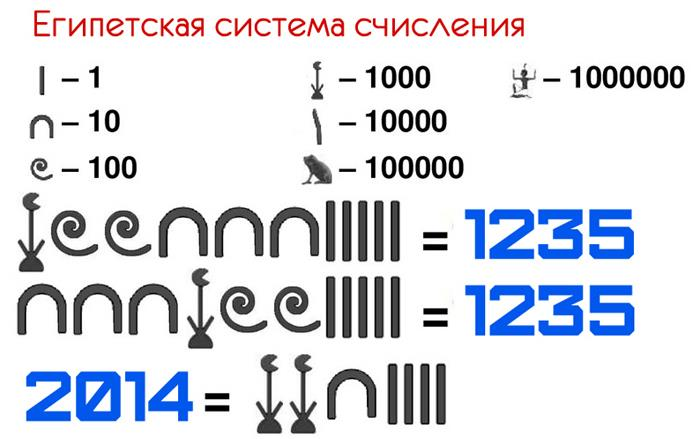
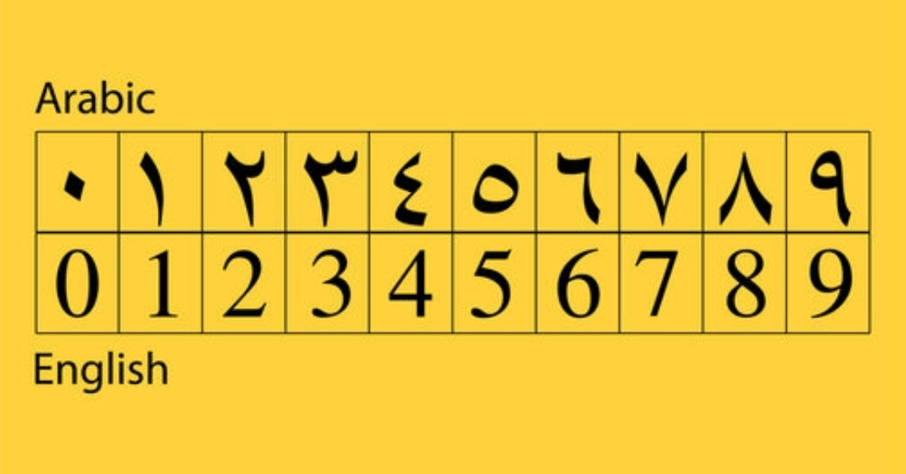

# О чем вообще курс?

# Требования к курсу

# Вопросы

## Вводная
- Что такое система счисления? Зачем она вообще нам?
- *Какие бывают?
- В каком разряде находится цифра 3 в числе 54132 (по номеру и по названию)?

## Позиционные СС

# Задания

## Вводная

### Римская СС
- Записать в привычном нам виде римские числа

- Записать числа в риской системе счисления: 

Примеры:
- 97 - CVII
- 2312 - MMCCCXII
- 1912 - MDCDXII,
- 927 - CMXXVII,
- 672 - DCLXXII,
- 2436 - MMMCDXXX,

Сложить:
- DCCCVII и MCCCXII = 87 + 1312 = 1399 = MDCCCXCIX
Можно вычесть ещё, но не уверен, что нужно, можно в ДЗ пихнуть, если будет нужно.

## Позиционные СС
- Перевести из любой другой позиционной системы в десятичную.
- Перевести из десятичной в другую

# Теория

## Вводная
**Система счисления (СС)** - совокупность приемов и правил для записи чисел цифровыми знаками.

Среди систем счисления принято выделять:
- Позиционные.
- Непозиционные.

**Непозиционная система счисления** – система, для которой значение символа не зависит от его положения в числе.

### Унарная
Самый простой пример: унарная система - запись любого числа n просто n-ным количеством одинаковых символов. 
Это простейшая система счисления известна нам ещё с древних времен и используется нами по сей день. Как? Когда мы загибаем пальцы на руке, чтобы показать, например, количество людей в комнате, то по сути используем именно эту систему счисления. *Можно на примере людей на паре или количества отрядов*
Однако записать с помощью такой системы счисления достаточно большие числа сложно. Да и прочитать тоже.

### Египетская
Другой пример непозиционной системы счисления является египетская. Там в качестве цифр были степени 10: от одного до миллиона. 

### Римская
Римскую систему счисления также относят к непозиционным (хотя и с оговоркой). Ей мы пользуемся и сейчас, хоть и редко. Например с её помощью часто обосзнают номера веков.
В ней есть следующие цифры:
|римская цифра|арабское число|
|-|-|
|I| 1|	
|V| 5|
|X|	10|
|L| 50|
|C| 100|
|D| 500|
|M| 1000|

*Больше трёх одинаковых цифр подряд не ставят*, но есть следующие правило: если меньшая цифра стоит перед большей, то она меньшая берется со знаком минус, т.е. вычитается из большей. 
Например число 4 записывали как IV. В такой записи меньшая цифра (I) стоит перед большей (V), поэтому она вычитается из неё. 
По причине этой особенности нельзя считать римскую систему счисления полностью непозиционной.

Примеры записи: XIX - 19.

**Тут бы хорошо дать практические задания**

В чем проблемы римской СС? (Можно конечно и на подумать дать задание, но тут уж как пойдёт. )
Проблемы римской и египесткой СС в том, что:
- чтобы записывать большие числа нужно вводить всё новые и новые цифры.
- сложно выполнять арифметические операции.
- можно записывать только натуральные числа (что делать с дробными, отрицательными или хотя-бы нулем).

## Позиционные СС
Доска: **Позиционная система счисления** - система, в которой значение цифры (её вес), полностью определяется её местом (позицией) в числе.

Пример позиционной системы счисления - привычная нам десятичная СС. 
В числе 657, цифра 6 обозначает сотни (600), цифра 5 - десятки(50), цифра 7 - единицы.

657 = 6 * 100 + 5 * 10 + 7

**Алфавит СС** - используемый в CC набор цифр (символов).

Любая позиционная система характеризуется основанием.

**Основание** позиционной системы счисления – количество знаков или символов, используемых в алфавите.

В случае десятичной оно, внезапно, равно 10.

**Разряд** - позиция цифры в записи числа. Разряды в записи целых чисел нумеруются с нуля справа налево.

Пример: В числе 357, `3` стоит во втором разряде (сотни, $10^3$) и т.д.

Т.е. $357 = 3*10^2 + 5*10^1 + 7 * 10^0$

Это так называемая **развернутая форма записи числа**

В общем случае целое положительное число А в позиционной СС мож­но представить выражением:

$А = a_n p^n + a_{n-1} p^{n-1} + a_{n-2} p^{n-2} + ... + a_1 p^1 + a_0 p^0 = \sum_{k=0}^{n}{a_k p^k}$, где p - основание СС, k - номер разряда, $a_k$ - цифра в k-м разряде (точнее её количественный эквивалент, т.е. то, какое количество обозначает цифра), 

Обозначения цифр берут из алфавита, который содержит р символов. Каждой цифре соответствует определенный количественный эквивалент. Так например цифра `1` - обозначает что-то в количестве один. Не два и не три, а именно один.
Вроде бы для нас это очевидно. Но если заменить привычные нам знаки на другие. Например, на то, как то же количество обозначается в арабском, то уже не так просто сказать, какой символ какому количеству соотвествует. 

Забавно, что цифры, которые мы ежедневно используем, называются `арабскими`, но при этом в арабском пишуться они по другому.

Но вернемся к представлению чисел в СС.
Запись $А_{(p)}$ указывает, что число $А$ представлено в СС с основанием $р$. Так, например по записи $243_{10}$ понятно, что число записано в десятичной системе счисления.

### Перевод в десятичную СС
А что же с другими СС, помимо десятичной? Например возьмем восьмиричную. Т.е. в ней всего 8 цифр (0,1,2,3,4,5,6,7). 
Для неё все также справедлива предыдущая формула. Например число $123_8$ можно представить как $1*8^2 + 2*8^1 + 3*8^0$. И если вычислить значение по этой формуле как мы привыкли - в десятичной СС, то получиться $64_{10}+16_{10}+3_{10}=83_{10}$ Ничего странного в этом нет. Просто $83_{10} = 123_{8}$. Т.е. число одно и тоже, но записывается по разному. 

Только что был пример того, как из другой позиционной СС переводить в 10-ную.

**задания**

### Перевод из десятичной СС
В обратную сторону переводить делать чуть сложнее. Нужно как-то получить цифры. Раз все цифры можно найти из развернутой формы записи числа, то можно просто привести число к этой форме. 

Можно переписать эту формулу в более удобном для нашей задачи виде:

$A = a_n p^n + a_{n-1} p^{n-1} + a_{n-2} p^{n-2} + ... + a_1 p^1 + a_0 p^0 = (... ((a_n p + a_{n-1}) p + a_{n-2}) p + ... + a_1) p + a_0 $

Тут уже более наглядно видно что нужно делать, чтобы найти цифры числа:
1. Для самой правой цифры всё просто, вдеь она меньше основания p, а остальная часть чилса на p делиться. Т.е. чтобы получить самую правую цифру нужно найти остаток от деления числа на p.
2. Теперь вычтем из A нашу цифру и поделим результат на p. Получиться $(... ((a_n p + a_{n-1}) p + a_{n-2}) p + ... + a_1)$.
3. Теперь также как и в п.1 можно найти следующую цифру $a_1$. 

По этому алгоритму мы и идем пока не дойдем до состояния, когда цифр больше не будет, т.е. оставшееся число меньше p.

Рассмотрим на примере перевода числа $352_{10}$ в восьмеричную СС:
1. 352 mod 8 = 0. Получили цифру 0 в самом младшем (правом) разряде.
2. Оставшееся число поделим на 8. (352-0) : 8 = 44. 44 > 8, продолжаем.
3. 44 mod 8 = 4. Получили цифру 4 во втором разряде.
4. Оставшееся число поделим на 8. (44-4) : 8 = 5
5. 5 < 8. Так что самая левая цифра будет 5.

Получили, что $352_{10} = 540_{8}$

**Задания**

### Основание больше 10
До этого момента мы рассматривали только позиционные СС с основанием меньше или равные 10. Но теоретически ничего не мешает нам использоваить и позиционные СС с основанием больше 10. Только нужно придумать как обозначать цифры, следующие после '9'. Для этого принято использовать латинские буквы от A до Z. Наиболее используемой из таких СС является шестнадцатиричная. 

**Задания на перевод между 16-ричной и (10-чной и 2-ичной)**

А что же делать, если требуется основание большее, чем 10+26=36? Ну, тут уже никаких принятых обозначений, насколько я знаю, нет.

## Применение, зачем СС так много?
Зачем же вообще нужно столько разных СС? Дело в том, что они могут быть удобны для разных задач.

### Двоичная система в компьютерах, почему?
Например, двоичная СС используются для представления чисел в компьютере. Но почему же?
На самом деле в начале развития ЭВМ (электронно вычислительной техники) компьютеры могли использовать самые разные системы счисления. Например, некоторые компьютеры использовали привычную нам десятичную СС. Реализованы они были при помощи шестеренок с десятью зубцами. И потенциально использовать то можно было почти любую СС.

Так почему же была выбрана двоичная? Для компьютеров она имеет ряд преимуществ:
- для ее реализации нужны технические устройства с двумя устойчивыми состояниями (есть ток - нет тока, намагничен - не намагничен и т.п.), а не, например, с десятью, - как в десятичной;
- представление информации посредством только двух состояний надежно и помехоустойчиво;
Т.е. за счёт малого количества используемых цифр-состояний она просто оказалась удобнее.

**Задания на числа в двоичной СС**

#### Быстрый перевод между 2 и 2^(n)
Можно было заметить, что двоиные числа нам воспринимать довольно сложно.
Двоичная система, удобная для компьютеров, для человека не так удобна из-за громоздкости записи. Та же особенность двоичной СС, которая позволяет удобно реализовывать арифметику и хранение с помощью электронных компонентов, мешает людям воспринимать такие числа. 
Перевод чисел из десятичной системы в двоичную и наоборот обычно выполняет машина и нам не нужно погружаться в особенности представления внутри неё. Однако в некоторых случаях требуется спуститься на уровень ниже. Но использовать двоичную систему всё равно не хочется, уж слишком числа получаются громоздкие. Что же делать? Для этого можно использовать СС с основанием равным степеням двойки. У них есть замечательное свойство - возможность быстро переводить числа между этими СС и двоичной. Сейчас объясню как и почему.

Возьмем число в двоичной СС и запишем его в развернутой форме: 

$a_n 2^n + a_{n-1} 2^{n-1} + a_{n-2} 2^{n-2} + ... + a_1 2^1 + a_0 2^0$

Теперь припишем слева нули, чтобы колчество цифр в числе делилось на 4 и  объединим цифры в группы по 4, начиная с самой правой. 

$(a_{4k+3} 2^{4k+3} + a_{4k+2} 2^{4k+2} + a_{4k+1} 2^{4k+1} + a_{4k} 2^{4k})+ ... + (a_3 2^3 + a_2 2^2 + a_1 2^1 + a_0 2^0)$

$(a_{4k+3} 2^3 + a_{4k+2} 2^2 + a_{4k+1} 2^1 + a_{4k} 2^0) * 2^{4k} + ... + (a_3 2^3 + a_2 2^2 + a_1 2^1 + a_0 2^0)$

$(a_{4k+3} 2^3 + a_{4k+2} 2^2 + a_{4k+1} 2^1 + a_{4k} 2^0) * 2^{4k} + ... + (a_3 2^3 + a_2 2^2 + a_1 2^1 + a_0 2^0) * 2^{4*0}$

$(a_{4k+3} 2^3 + a_{4k+2} 2^2 + a_{4k+1} 2^1 + a_{4k} 2^0) * 16^k + ... + (a_3 2^3 + a_2 2^2 + a_1 2^1 + a_0 2^0) * 16^{0}$

Можно заметить, что у нас получилось развернутая форма hex числа. Осталось получить цифры (в скобках). Но их, благо, всего 16 вариантов.

|hex|bin|
|-|----|
|0|0000|
|1|0001|
|2|0010|
|3|0011|
|4|0100|
|5|0101|
|6|0110|
|7|0111|
|8|1000|
|9|1001|
|A|1010|
|B|1011|
|C|1100|
|D|1101|
|E|1110|
|F|1111|

### Симметричные позиционные СС (дополнение, можно и выкинуть из курса, но по мне это интересно)
До этого мы говорили только о позиционных СС, где все цифры больше или равны 0, но в общем-то никто не запрещает использовать и другие цифры. Так сейчас хочу рассказать о троично-симметричной СС. 

Раз она троичная, то имеет основание равное 3 и соотвественно цифр там 3. Но вот только это не привычные нам {0,1,2}, а {-1,0,1}. Потому она и называется троично-**симметричной**. В симметричных СС у каждой цифры, кроме 0 есть отрицательная пара.

### Представление отрицательных чисел в двоичной СС.